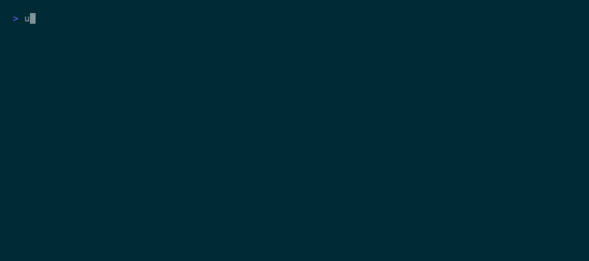
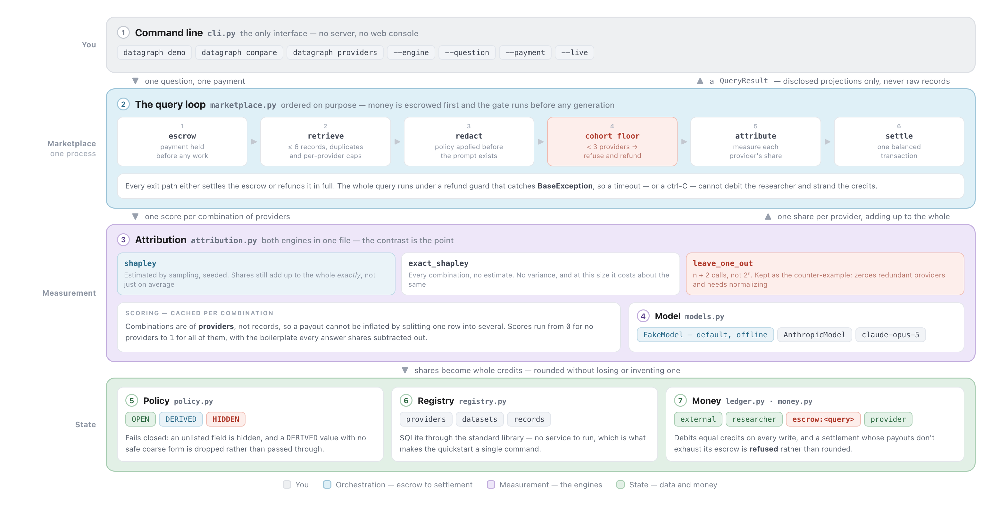

# datagraph

Royalty splits for AI answers, measured from the answer itself.

[](https://github.com/ashnkumar/datagraph/actions/workflows/ci.yml)
[](https://www.python.org/downloads/)
[](LICENSE)



One query, four providers, 1000 credits, three ways of splitting it. `borealis` and `cascade` are
seeded with the same fact on purpose, and the two red zeros are what the obvious method pays them
for it. Its weights come to `0.2744` of the payment, so the rest goes to whoever happened to be
unique.

*See the **[technical post](https://example.com/datagraph-technical-post)** for more details.*

## Quickstart

```bash
git clone https://github.com/ashnkumar/datagraph && cd datagraph
uv run datagraph compare
```

Needs Python 3.11+ and [uv](https://docs.astral.sh/uv/). No API key, no services, no containers —
the default model is a deterministic offline stand-in, so `compare` prints the same table on any
machine. It runs one query under all three engines, side by side.

`uv run datagraph demo` runs a single query end to end and shows the working: what was retrieved,
what redaction removed, the answer, and who got paid.

**To use the real API:** `cp .env.example .env`, put your key in it, and add `--live`.

## The problem

Retrieval-augmented generation has a payment problem. A model answers a question using records
retrieved from several data providers, the asker pays once for that answer, and something has to
decide how much of that payment each provider earned.

Paying whoever got retrieved is the obvious move, and it pays for showing up: a record that changed
nothing earns what the record carrying the answer earns. The way to earn more becomes publishing
more rows, not better ones.

The better question is what each provider was worth — take one away and see what changes. That
works until two providers hold the same fact. Remove either and nothing changes, so both measure as
worthless, and the shares that are left no longer add up to the payment.

**`datagraph` divides the payment by how much each provider's data actually changed the answer, in
shares that add up to the whole by construction rather than by being scaled to fit.**

| | Paying by retrieval | With `datagraph` |
|---|---|---|
| **Two providers hold the same fact** | Both look equally cited, or under leave-one-out both score zero and their share is silently reassigned | They split the credit — `195` and `203` of 1000 from the sampled engine, `197` each computed exactly |
| **Does the payment balance** | Shares don't add up to the whole, so the gap is closed by scaling them to fit | Shares add up exactly, so the escrow is exhausted with nothing left to redistribute |
| **Padding your dataset** | More rows returned means more payout | Payout is invariant to row count — 10 extra copies of every `delta` record leave it on `365` credits |

Leave-one-out is the alternative worth taking seriously: where providers hold disjoint data it wins
outright, at one model call per provider instead of one per combination, and both engines rank
providers the same way. On the demo that is 6 calls against 16 — one per provider, plus the
reference answer and the no-records baseline that every run needs.

## How it works


**Retrieve and redact.** Every field is `OPEN`, `DERIVED` (banded) or `HIDDEN`. Hidden fields never
reach the prompt builder, and anything unlisted is hidden by default. A query with fewer than three
providers behind it is refused before the model runs.

**Score by re-answering.** Each combination of providers is scored on how much of the answer it can
produce alone, then cached. Retrieval caps a query at six providers, so sampling 2000 orderings and
enumerating all 16 combinations cost the same 16 model calls.

**Settle once.** Fractional shares become whole credits under a rounding rule that can't lose or
invent one, and the ledger refuses any settlement that doesn't exhaust the escrow. A provider that
scores below zero leaves the rest claiming more than the payment, so the query is refunded rather
than scaled down to fit.

### Architecture



| # | Component | Module | What it does |
|---|---|---|---|
| **1** | Command line | `cli.py` | The only interface — `demo`, `compare`, `providers` |
| **2** | Marketplace loop | `marketplace.py` | Escrow, retrieve, redact, check the cohort floor, attribute, settle |
| **3** | Attribution | `attribution.py` | Both engines and the scoring, in one file on purpose |
| **4** | Model | `models.py` | The `ModelClient` protocol, the Anthropic client, the offline stand-in |
| **5** | Policy | `policy.py` | Disclosure levels, redaction, the cohort floor |
| **6** | Registry | `registry.py` | Providers, datasets, records, retrieval — SQLite, stdlib only |
| **7** | Money | `ledger.py`, `money.py` | Double-entry accounts with escrow; integer credits and apportionment |

Start with `src/datagraph/attribution.py`. It holds both engines and it is 362 lines. `SPEC.md` has
the design notes — how the split is computed, the rejected alternatives, and every design revision
with the test that forced it.

## Commands

| Command | What it does |
|---|---|
| `datagraph demo` | One query end to end: retrieval, redaction, the answer, payouts, ledger check |
| `datagraph compare` | The same query under all three engines, side by side |
| `datagraph providers` | The seeded providers and which fields each one discloses |

`--question` and `--payment` work on `demo` and `compare`; `--engine` selects `shapley`,
`exact_shapley`, or `leave_one_out` on `demo`. `--live` calls the real API instead of the offline
model — on `compare` that is three runs, so it says what it is about to spend. `.env.example` lists
every environment variable.

## Tests

```bash
uv sync --extra dev
uv run pytest            # 148 tests, offline, no API key
uv run pytest -m live    # one end-to-end test against the real API
```

The engines are tested against small synthetic games whose correct answers are known in closed form,
so the assertions check the mathematics rather than a model's mood — read `tests/test_attribution.py`
first. `tests/test_docs.py` pins the figures on this page to the code — the payout rows, the weight
sums, the replication and false-name examples, the model-call counts, and the line count two
sections up — so a number that drifts out of date fails the build instead of the reader.

## Limitations

- **It counts accounts, not people.** Extra copies of a record earn nothing, but registering twice
  does: splitting `delta`'s two records across two accounts took its combined take
  from `365` to `446` of 1000. Nothing here checks that two providers are different people. The fix
  is identity or stake underneath the measurement, not a change to the scoring.
- **Privacy is procedural, not cryptographic.** Redaction happens before the prompt is built, so no
  prompt-side rule can leak a hidden field — but `HIDDEN` values sit in cleartext SQLite, and an
  operator with database access reads them. Real guarantees need the raw values never to reach this
  tier: trusted execution, secure aggregation, or differential privacy on the provider's side.
- **The live path is not reproducible, and its noise is paid out.** Any non-default `temperature`,
  `top_p` or `top_k` returns a 400 and there is no `seed`. A provider's score is the gap between two
  independently sampled answers, so wording that moved on its own is credited to whoever was in
  that combination: the shares stay exact, but which provider earned them gets noisier. The offline
  model is deterministic, which is why it is the default.

`SPEC.md` §7 and §8 have the rest, including the two worth knowing before you trust a number: the
contribution score is a proxy for meaning rather than a measure of it, and the ledger is
single-process and in-memory while only the registry persists.

## License

MIT — see [LICENSE](LICENSE).
